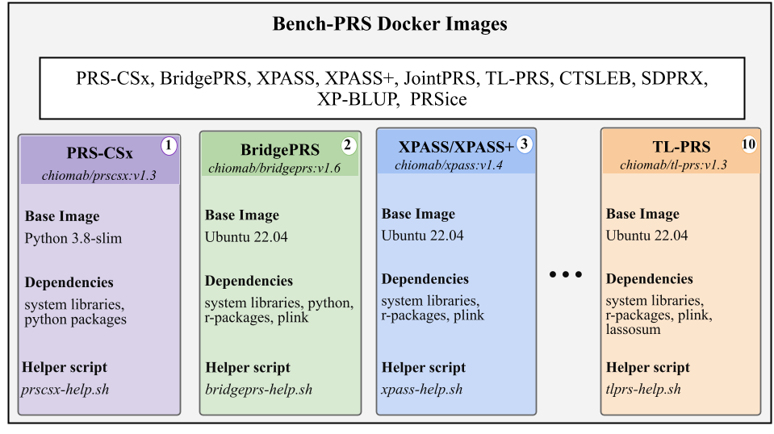

# Bench-PRS Dock: Containerised Multi-Ancestry Polygenic Risk Score Tools

Reproducible Docker images for ten multi-ancestry polygenic risk score (PRS) tools, and a benchmark
comparing each tool run across native, Docker and Apptainer execution (setup time, execution time,
peak memory and output consistency).

Every image is **self-documenting**: a bare `docker run <image>` prints the tool's usage - and
**self-verifying**: `docker run <image> goss -g /goss.yaml validate` checks its internal dependencies.
All images are on Docker Hub under [`chiomab`](https://hub.docker.com/u/chiomab).



## Tools

| Tool | Image | Method | Page |
|------|-------|--------|------|
| PRSice-2 | `chiomab/prsice:v1.1` | Clumping + p-value thresholding | [prsice](docs/tool_pages/prsice.md) |
| PRS-CSx | `chiomab/prscsx:v1.3` | Bayesian continuous shrinkage | [prscsx](docs/tool_pages/prscsx.md) |
| SDPRX | `chiomab/sdprx:v1.1` | Nonparametric Bayesian mixture | [sdprx](docs/tool_pages/sdprx.md) |
| TL-PRS | `chiomab/tl-prs:v1.3` | Transfer learning | [tl-prs](docs/tool_pages/tl-prs.md) |
| XPASS / XPASS+ | `chiomab/xpass:v1.4` | Bayesian hierarchical | [xpass](docs/tool_pages/xpass-xpass_plus.md) |
| BridgePRS | `chiomab/bridgeprs:v1.6` | Bayesian ridge regression | [bridgeprs](docs/tool_pages/bridgeprs.md) |
| JointPRS | `chiomab/jointprs:v1.1` | Multi-population Bayesian | [jointprs](docs/tool_pages/jointprs.md) |
| CT-SLEB | `chiomab/ctsleb:v2.1` | Clump-threshold + empirical Bayes + super-learning | [ctsleb](docs/tool_pages/ctsleb.md) |
| XP-BLUP | `chiomab/xpblup:v1.1` | Two-component linear mixed model | [xpblup](docs/tool_pages/xpblup.md) |

Full details (base image, language, dependencies, digests): [`docs/image_inventory.md`](docs/image_inventory.md).

## Quick start

```bash
# pull a tool image
docker pull chiomab/prsice:v1.1

# print its usage
docker run --rm chiomab/prsice:v1.1

# check its internal dependencies
docker run --rm chiomab/prsice:v1.1 goss -g /goss.yaml validate
```

The same images work with Apptainer/Singularity on HPC:

```bash
apptainer pull docker://chiomab/prsice:v1.1   # builds prsice_v1.1.sif
apptainer run prsice_v1.1.sif                 # prints usage
```

## Benchmark results

Across all ten tools, Docker setup is faster than native install for every tool (it pulls a ready
image), and execution time and peak memory are near parity between the two modes. Deterministic tools
produce byte-identical native and Docker output. See [`docs/RESULTS.md`](docs/RESULTS.md) for the full
tables and [`figures/`](figures) for the plots.

The same ten tools were also run on an HPC under Apptainer, on the same dataset, to test whether the
images carry across machines and container runtimes. Those results are in [`hpc/`](hpc). Consistency
is assessed on the per-individual polygenic score for every tool, so the tools are directly
comparable.

## Build provenance

[`provenance/`](provenance) records, for each image: the base image and tag, the tool source commit or
release, the image SHA-256, the thread settings and random seeds used, and the full dependency
lockfile exported from inside the image itself (conda, pip, R packages and system packages as
applicable). The summary table is
[`provenance/tool_provenance.csv`](provenance/tool_provenance.csv).

## Repository structure

```
dockerfiles/<tool>/      Dockerfile + usage helper + goss spec (+ runner, lockfile)
provenance/              dependency lockfiles exported from each image + tool_provenance.csv
docs/
  RESULTS.md             benchmark tables
  image_inventory.md     image, base, language, method, dependencies, digests
  tool_pages/            one page per tool (method, authors, paper, usage)
benchmark/
  harness/local/         native and Docker runner (obj1_bench.py, registry.json)
  harness/hpc/           Apptainer runner and Slurm submission scripts
  harness/shared/        R runners used by both environments
  analysis/              scripts that regenerate the result CSVs and figures
  digests/               SHA-256 digests of the per-individual score files
  local/results/         native and Docker CSVs
  local/figures/         native and Docker figures
  hpc/results/           Apptainer CSVs
  hpc/figures/           Apptainer figures
  hpc/notes/             note on BLAS kernel selection across CPUs
```

## Reproducing the benchmark

### Pull the images

Images are not stored in this repository. Pull them from Docker Hub:

```bash
docker pull chiomab/prsice:v1.0      docker pull chiomab/bridgeprs:v1.5
docker pull chiomab/prscsx:v1.2      docker pull chiomab/jointprs:v1.0
docker pull chiomab/sdprx:v1.0       docker pull chiomab/ctsleb:v2.0
docker pull chiomab/tl-prs:v1.2      docker pull chiomab/xpblup:v1.0
docker pull chiomab/xpass:v1.3       # XPASS+ shares this image
```

On an HPC the same images run under Apptainer:

```bash
apptainer pull docker://chiomab/prsice:v1.0
```

To pin an exact build rather than a tag, pull by digest. The digests are in
`provenance/tool_provenance.csv`:

```bash
docker pull chiomab/xpass@sha256:b845cb812678926390105639be9528caf2fbc38657887c8abe6f92db3a479e43
```

### Where each table and figure comes from

| Paper item | Produced from | Script |
|---|---|---|
| Table 1, tools packaged | `docs/tool_pages/` | - |
| Table 2, build specifications | `provenance/tool_provenance.csv`, `docs/image_inventory.md` | - |
| Table 3, setup wall-time | `benchmark/local/results/benchmark_summary.csv` (setup rows), `benchmark/hpc/results/benchmark_summary.csv` | `benchmark/analysis/prep_master.py` |
| Table 4, execution wall-time and peak memory | the same two files (exec rows) | `benchmark/analysis/prep_master.py` |
| Table S2, data sources | not in this repository, see the accessions in the paper | - |
| Table S3, build provenance | `provenance/tool_provenance.csv` and the lockfiles beside it | - |
| Table S4, score file digests | `benchmark/digests/per_individual_score_digests.csv` | - |
| Table S5, consistency metrics | `benchmark/hpc/results/consistency_per_individual.csv`, `consistency_native_vs_docker.csv`, `consistency_three_way.csv` | - |
| Local figures | `benchmark/local/figures/` | `benchmark/analysis/plot_obj1_benchmarks.py` |
| HPC figures | `benchmark/hpc/figures/` | `benchmark/analysis/plot_hpc_benchmarks.py` |

### Running it

```bash
python benchmark/harness/local/obj1_bench.py exec <tool>   # native and Docker
bash   benchmark/harness/hpc/submit_chain.sh               # Apptainer under Slurm
python benchmark/analysis/prep_master.py                   # rebuild the result CSVs
python benchmark/analysis/plot_obj1_benchmarks.py          # rebuild local figures
python benchmark/analysis/plot_hpc_benchmarks.py           # rebuild HPC figures
```

### Per-individual outputs are not shared

The target genotypes are controlled-access dbGaP data (accession phs001391.v1.p1), so the
per-individual polygenic score files cannot be redistributed here. They are excluded by
`.gitignore`.

What is published instead is their SHA-256 digests, in
`benchmark/digests/per_individual_score_digests.csv`, which reveal nothing about any
individual. An authorised user who regenerates the scores with the commands in
`benchmark/harness/` can hash their own output and confirm it matches, which verifies the
consistency results without exposing participant data. `benchmark/DATA_AVAILABILITY.md`
records the exact scoring commands used for the three tools whose scores were derived with
plink.

## Building an image

Each `dockerfiles/<tool>/` folder is a self-contained recipe (the tool installed from its GitHub
source, plus the usage helper, goss self-test, and non-root user):

```bash
cd dockerfiles/prsice && docker build -t chiomab/prsice:v1.1 .
```

## Citation

If you use these images or results, please cite this repository (see [`CITATION.cff`](CITATION.cff))
and the original tool (each tool page links its paper).

## Maintainer

Chioma Oselu - chiomabonyido@gmail.com · Docker Hub: [chiomab](https://hub.docker.com/u/chiomab)
